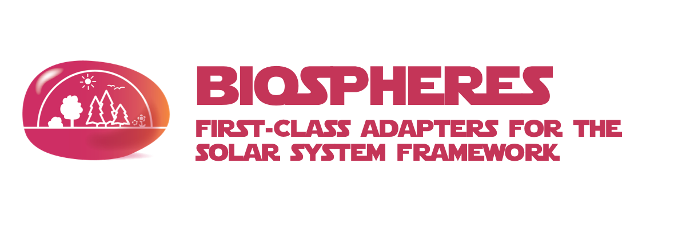

# biospheres



> **THIS PROJECT IS STILL IN THE DESIGN PHASE**
>
> IDEAS & CONTRIBUTIONS ARE WELCOME
>
> An [Open Source Universe](https://github.com/intellibus/approach) Project

---

## Contents

- [biospheres](#biospheres)
  - [Contents](#contents)
  - [Features ✨](#features-)
  - [Install 🛠](#install-)
  - [Usage 🔭](#usage-)
  - [Documentation 🛰](#documentation-)
  - [Contributing 🌎](#contributing-)
  - [License ⚖️](#license-️)

## Features ✨

- Javascript / Typescript Language Adapter  `Planned`
- Terraform IaC Adapter  `Planned`
- AWS Cloud Adapter  `Planned`
- Google Cloud Adapter  `Planned`

## Install 🛠

```sh
npm install biospheres
```

## Usage 🔭

Read more about the [Design](https://github.com/intellibus/biospheres/blob/main/DESIGN.md) behind `biospheres` here.

`.solarsystem.json`

```json
{
  "lang": "biospheres/javascript",
  "iac": "biospheres/terraform",
  "cloud": ["biospheres/aws", "biospheres/gcp"],
}
```

## Documentation 🛰

`biospheres` *is under active development, documentation will be added once an initial release is ready.*

## Contributing 🌎

We would love for you to contribute your ideas, code, & fixes to `biospheres`.

We encourage everyone to read our [Design Document](https://github.com/intellibus/biospheres/blob/main/DESIGN.md) to learn more about the thought process behind biospheres.

Also check out the [rewards](https://github.com/intellibus/approach/blob/main/REWARDS.md) offered for contributing to the [Open Source Universe](https://github.com/intellibus/approach).

## License ⚖️

MIT
